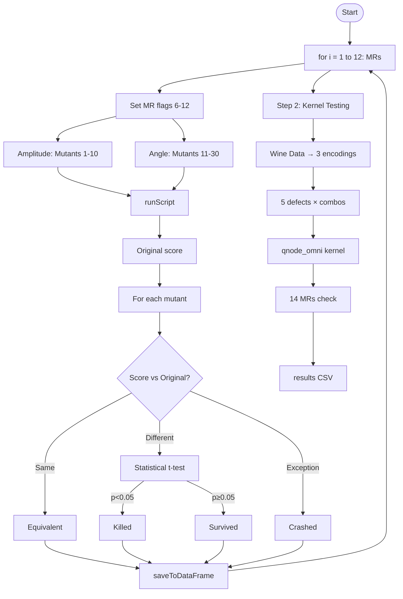
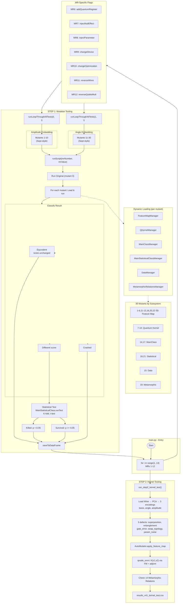

# QSVM Structure Testing - Visual Process Diagram

**View options:** Open in VS Code (Mermaid extension) or paste a code block at https://mermaid.live

---

## Simplified Flow (recommended for quick view)

---

## Full Diagram (with subgraphs)

